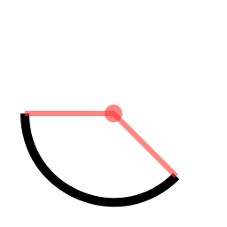
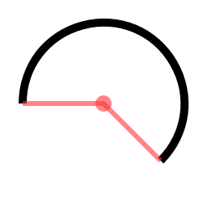
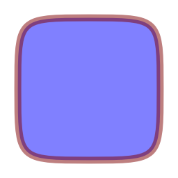
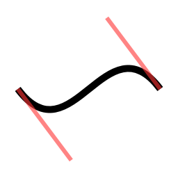
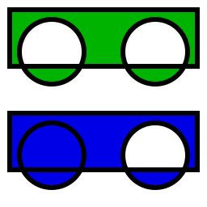
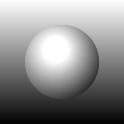
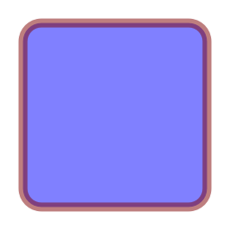
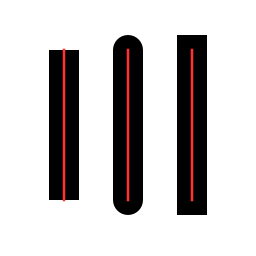
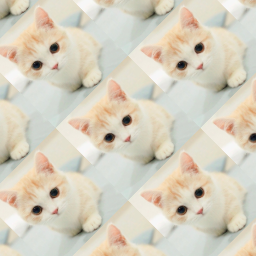
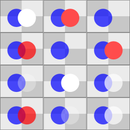

# libcg
A tiny C library for 2D computer graphics.

## Getting Started

The library's .c and .h files can be dropped into a project and compiled along with it. Just type `make` at the root directory to build the static library and the example binaries under [examples](examples).

```shell
make
```
## Documentation

Online documentation: [https://libcg.xboot.org](https://libcg.xboot.org)

## Screenshots






















## License

This library is free software; you can redistribute it and/or modify it under the terms of the MIT license. See [MIT License](LICENSE) for details.
